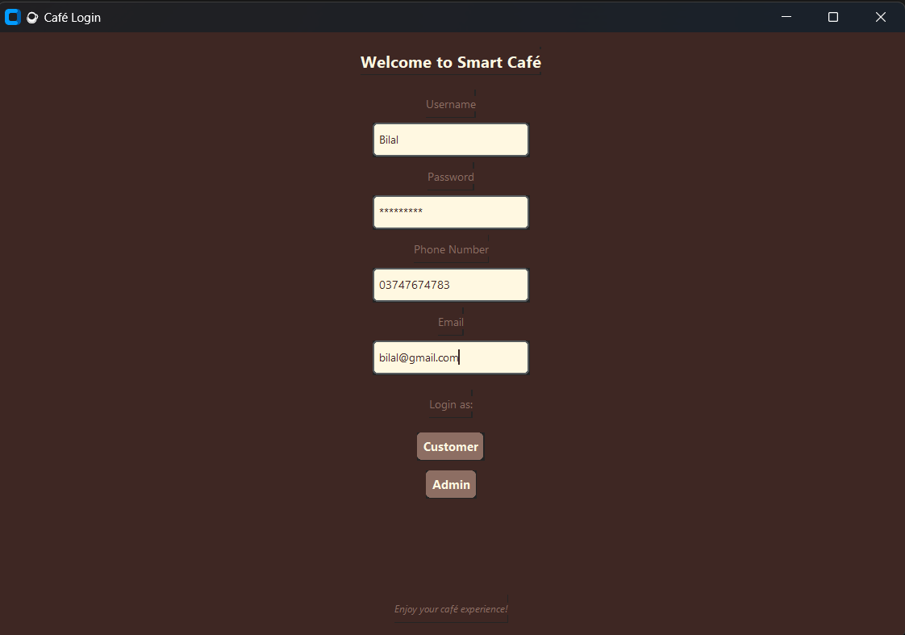
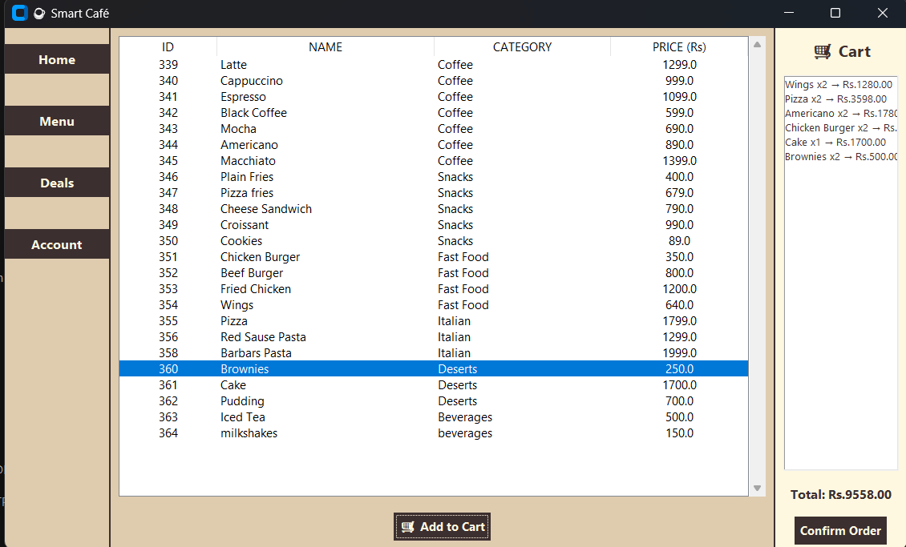
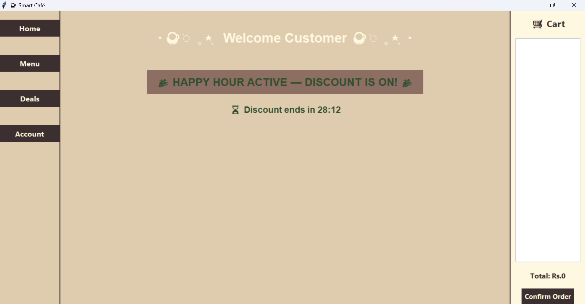
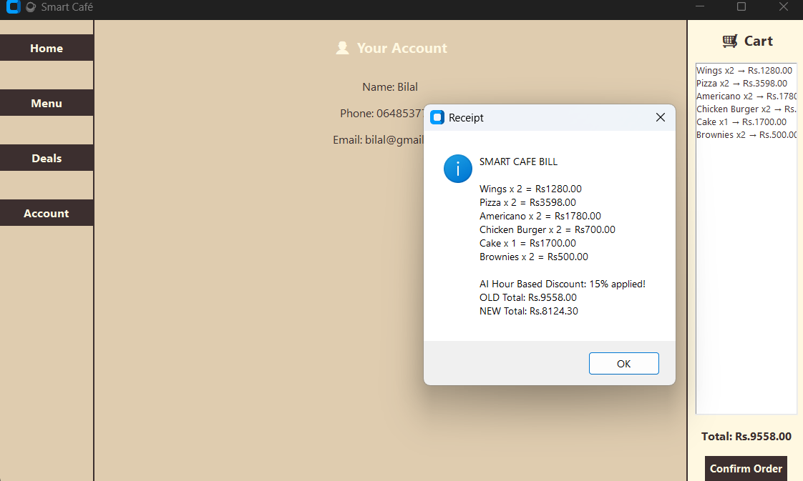
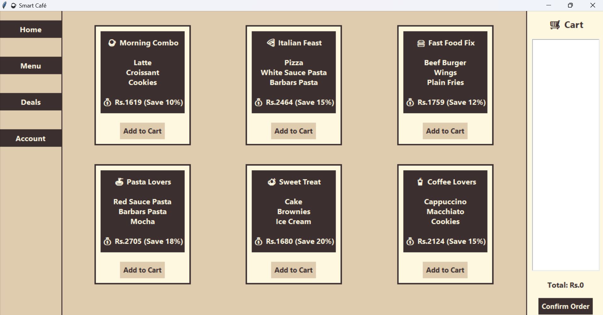
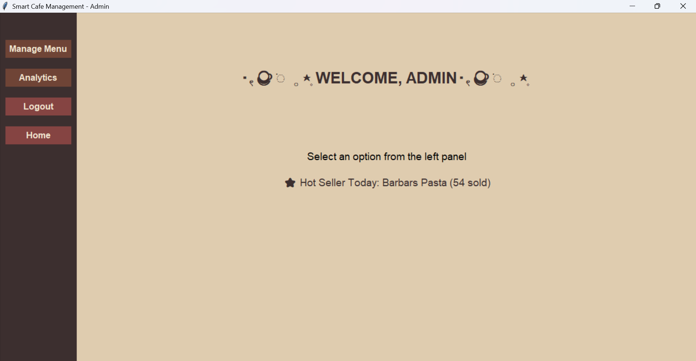
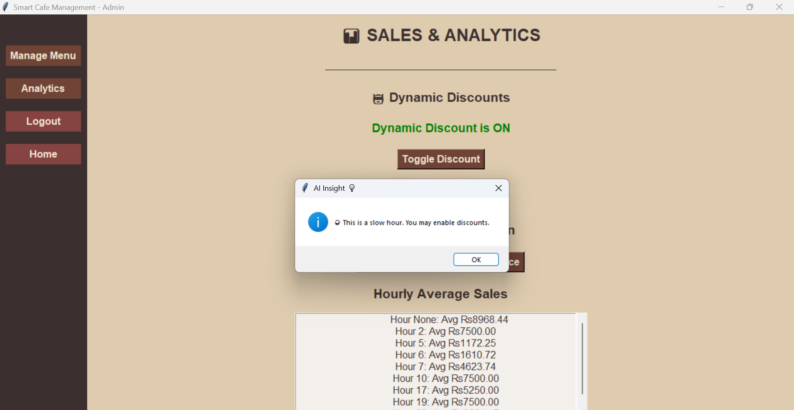
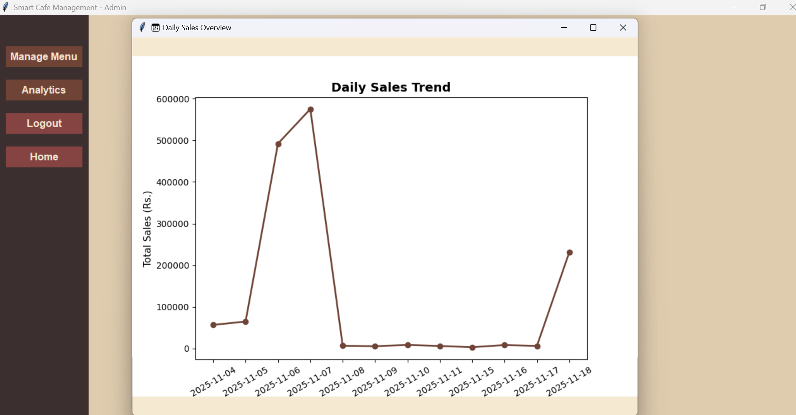
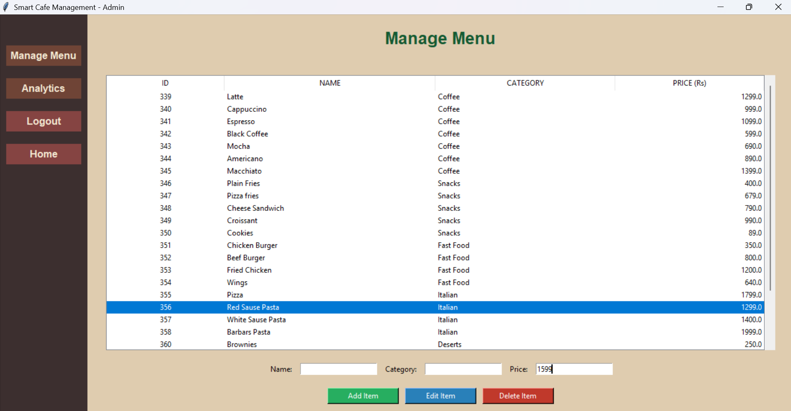

# ☕ Smart Cafe Management System

A desktop-based Cafe Management System developed in **Python** using **CustomTkinter** for the graphical user interface and **SQLite** for database management.

## 📌 Features

- 🔐 User Login System
- 👤 Admin Panel
- 🛒 Order & Billing System
- 💾 SQLite Database Integration
- 📊 Customer Record Management
- 🖥️ User-friendly GUI with CustomTkinter

## 🛠️ Technologies Used

- Python 3
- CustomTkinter
- sqlite3
- Tkinter

## 📂 Project Structure

```
Smart-Cafe-Management-System/
│
├── Admin.py
├── Bill.py
├── Database.py
├── GUI.py
├── Login.py
├── cafe_app.py
├── smart_cafe.db
├── requirements.txt
├── README.md
└── screenshots/
```

## 🚀 Installation

### 1. Clone the repository

```bash
git clone https://github.com/Alishba964/Smart-Cafe-Management-System.git
```

### 2. Open the project folder

```bash
cd Smart-Cafe-Management-System
```

### 3. Create a virtual environment (Optional)

```bash
python -m venv .venv
```

### 4. Activate the virtual environment

**Windows**

```bash
.venv\Scripts\activate
```

### 5. Install dependencies

```bash
pip install -r requirements.txt
```

### 6. Run the project

```bash
python cafe_app.py
```

## 📸 Screenshots


### Login Page



## Customer 

### Menu



### Customer Home Page



### Billing Report



### Deals




## Admin

### Admin Panel



### Discount Recommendations



### Sales and Analytics



### Edit Menu




## 👩‍💻 Developed By

**Alishba Khan**

---

⭐ If you like this project, don't forget to give it a star.